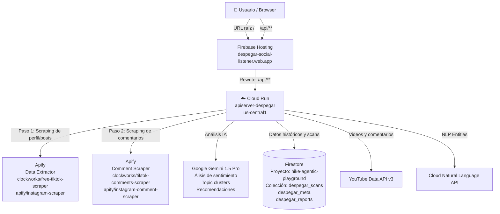

# 📡 Despegar Social Listener — Documentación Completa del Sistema

> Última actualización: Marzo 2026  
> Versión activa en producción: `apiserver-despegar-00056`

---

## 🗺️ Mapa General del Sistema



---

## 🌐 URLs y Links Útiles

| Recurso | URL |
|:--------|:----|
| **Aplicación en producción** | https://despegar-social-listener.web.app |
| **API de producción (Cloud Run)** | https://apiserver-despegar-966549276703.us-central1.run.app |
| **Repositorio GitHub** | https://github.com/DARTSTEAM/despegar-social-listener |
| **Firebase Console** | https://console.firebase.google.com/project/hike-agentic-playground |
| **Cloud Run (GCP)** | https://console.cloud.google.com/run?project=hike-agentic-playground |
| **Firestore Console** | https://console.cloud.google.com/firestore/databases/-default-/data?project=hike-agentic-playground |
| **Apify Console** | https://console.apify.com |
| **Cloud Build Logs** | https://console.cloud.google.com/cloud-build/builds?project=hike-agentic-playground |

---

## 🏗️ Estructura del Repositorio

```
despegar-social-listener/
│
├── frontend/                  ← React + Vite (UI)
│   ├── src/
│   │   ├── App.jsx            ← Router principal, estado global, handleScout / handleMassScan
│   │   ├── views/
│   │   │   ├── ScoutBotView.jsx    ← Scout Bot individual por cuenta
│   │   │   ├── SettingsView.jsx    ← Escaneo masivo, selector de cuentas
│   │   │   ├── DashboardView.jsx   ← Gráficos de sentimiento
│   │   │   ├── HistoryView.jsx     ← Historial de scans
│   │   │   ├── PostsView.jsx       ← Posts rankeados por engagement
│   │   │   └── YoutubeView.jsx     ← Sentimining de YouTube
│   │   └── components/
│   ├── .env.production        ← VITE_API_URL=https://apiserver-despegar-...run.app
│   └── dist/                  ← Build de producción (generado con npm run build)
│
├── functions/                 ← ⭐ Backend REAL (Node.js / Express)
│   ├── index.js               ← TODA la lógica: rutas API, scrapers, IA, Firestore
│   ├── server.js              ← Entrypoint: levanta Express en PORT (Cloud Run)
│   ├── agents/
│   │   ├── processor.js       ← InsightProcessor: llama a Gemini para análisis
│   │   └── youtube_processor.js
│   └── package.json
│
├── backend/                   ← ⚠️ Mirror local de functions/ (solo para dev local)
│   └── src/
│       ├── index.js           ← Copia de functions/index.js
│       └── server.js          ← Carga index.js y levanta en puerto 3001
│
├── firebase.json              ← Configuración de Firebase Hosting + rewrites /api/**
├── firestore.indexes.json     ← Índices compuestos de Firestore
└── docs/
    └── system_architecture.md ← Este archivo
```

> [!IMPORTANT]
> `functions/index.js` y `backend/src/index.js` son copias espejo del mismo código.
> Siempre editá `functions/index.js` (es el que va a producción) y luego copiá a `backend/src/index.js` si necesitás probarlo localmente.

---

## ⚙️ Cómo Funciona Cada Módulo

### 🔍 Scout Bot (análisis individual por cuenta)

**Endpoint:** `POST /api/scout`

**Input del frontend:**
```json
{
  "url": "https://www.tiktok.com/@despegar",
  "platform": "tiktok",
  "brand": "Despegar"
}
```

**Flujo de 2 pasos (⭐ crítico — NO saltear el Paso 1):**

```
Paso 1: clockworks/free-tiktok-scraper
        Input: { profiles: ["https://www.tiktok.com/@despegar"] }
        Output: lista de videos con URLs, likes, views, commentCount
                                ↓
Paso 2: clockworks/tiktok-comments-scraper
        Input: { postURLs: ["https://tiktok.com/video/xxx", ...] }
        Output: comentarios con author, text, likes
                                ↓
Paso 3: Gemini 1.5 Pro
        Input: array de comentarios normalizados
        Output: summary, sentiment, topicClusters, recommendations, suggestedReplies
                                ↓
Paso 4: Guardar en Firestore (colección despegar_scans)
        Responder al frontend con el análisis completo
```

**Para Instagram:**
```
Paso 1: apify/instagram-scraper
        Input: { directUrls: [perfilUrl], resultsType: "posts" }
        Output: posts con URLs, likes, commentsCount
                                ↓
Paso 2: apify/instagram-comment-scraper
        Input: { directUrls: [postUrl1, postUrl2, ...] }
        Output: comentarios
```

---

### 📡 Escaneo Masivo (Settings → Escanear cuentas)

**Endpoint:** `POST /api/admin/scout-all`

**Input del frontend:**
```json
{
  "selectedKeys": ["Despegar:tiktok", "Turismo City:instagram"]
}
```

**Flujo:**
1. El backend filtra `ALL_TARGETS` según `selectedKeys`
2. Lanza `performScouting()` en **segundo plano** (no bloquea la respuesta)
3. Responde inmediatamente: `{ status: "initiated", total: N }`
4. El progreso se escribe en Firestore: `despegar_meta/scoutStatus`
5. El frontend hace polling con `GET /api/admin/scout-status` cada 5 segundos
6. Cada cuenta usa el mismo flujo de 2 pasos que el Scout Bot

**Cuentas configuradas (ALL\_TARGETS en `functions/index.js`):**
| Brand | Plataforma | Tipo | URL |
|:------|:-----------|:-----|:----|
| Despegar | TikTok | Owned | https://www.tiktok.com/@despegar |
| Despegar | Instagram | Owned | https://www.instagram.com/despegar/ |
| Despegar AR | Instagram | Owned | https://www.instagram.com/despegar.ar/ |
| Turismo City | TikTok | Competitor | https://www.tiktok.com/@turismocity |
| Turismo City | Instagram | Competitor | https://www.instagram.com/turismocity_ar/ |
| Booking | TikTok | Competitor | https://www.tiktok.com/@bookingcom |
| Booking | Instagram | Competitor | https://www.instagram.com/bookingcom/ |
| Airbnb | TikTok | Competitor | https://www.tiktok.com/@airbnb |
| Airbnb | Instagram | Competitor | https://www.instagram.com/airbnb/ |

---

### 📺 YouTube Sentimining

**Endpoint:** `POST /api/youtube/analyze`

**Input:** `{ "videoUrl": "https://www.youtube.com/watch?v=XXXX" }`

**Flujo:**
1. Extrae el `videoId` de la URL
2. Llama a `streamers/youtube-comments-scraper` en Apify (máx 40 comentarios)
3. Analiza con Gemini
4. Guarda en Firestore `despegar_scans` con `platform: 'youtube'`

---

## 💾 Dónde se Almacena Cada Cosa

### Firestore — Colecciones

| Colección | Descripción | Campos clave |
|:----------|:------------|:-------------|
| `despegar_scans` | Todos los scans (Scout Bot + Masivo + YouTube) | `brand`, `platform`, `timestamp`, `sentiment`, `summary`, `raw_comments`, `commentsCount` |
| `despegar_meta/scoutStatus` | Estado en tiempo real del escaneo masivo | `status`, `completed`, `total`, `currentBrand`, `items[]` |
| `despegar_reports` | Reportes semanales generados | `createdAt`, `content` |

### Firebase Hosting

| Qué | Dónde |
|:----|:------|
| Archivos estáticos del frontend | `frontend/dist/` → subidos a Firebase Hosting |
| Dominio de producción | `despegar-social-listener.web.app` |
| Configuración de rewrites | `firebase.json` |

### Cloud Run

| Qué | Dónde |
|:----|:------|
| Código del backend | Imagen Docker generada desde `functions/` |
| Variables de entorno | Configuradas en el servicio Cloud Run (no en archivos) |
| Logs de ejecución | Google Cloud Logging / Cloud Run > Logs |
| Revisión actual | `apiserver-despegar-00056-9lb` |

---

## 🔑 Variables de Entorno

> [!CAUTION]
> Cada vez que hacés `gcloud run deploy`, las env vars se pierden si no se especifican en el comando. Siempre verificar después del deploy.

| Variable | Para qué sirve | Dónde configurarla |
|:---------|:---------------|:-------------------|
| `APIFY_API_KEY` | Autenticación con Apify para todos los scrapers | Cloud Run env vars |
| `GEMINI_API_KEY` | Análisis de sentimiento con Gemini 1.5 Pro | Cloud Run env vars |
| `YOUTUBE_API_KEY` | YouTube Data API (sugerencias de videos) | Cloud Run env vars |

**Comando para verificar que las keys están presentes:**
```bash
gcloud run services describe apiserver-despegar \
  --project hike-agentic-playground \
  --region us-central1 \
  --format="yaml(spec.template.spec.containers[0].env)"
```

**Comando para setearlas (si se pierden tras un deploy):**
```bash
gcloud run services update apiserver-despegar \
  --project hike-agentic-playground \
  --region us-central1 \
  --set-env-vars "APIFY_API_KEY=xxx,GEMINI_API_KEY=yyy,YOUTUBE_API_KEY=zzz"
```

---

## 🚀 Comandos de Deploy

### Frontend (Firebase Hosting)

```bash
# 1. Buildear
cd frontend
npm run build

# 2. Deploy
npx firebase deploy --only hosting --project hike-agentic-playground
```

> Cuándo hacerlo: cuando cambiás algo en `frontend/src/` (vistas, componentes, App.jsx)

---

### Backend (Cloud Run)

```bash
cd functions
gcloud run deploy apiserver-despegar \
  --source . \
  --project hike-agentic-playground \
  --region us-central1 \
  --quiet
```

> [!WARNING]
> Después de cada deploy al backend, verificar que las env vars no se hayan perdido.
> Correr el comando de verificación de env vars y luego el de setearlas si es necesario.

> Cuándo hacerlo: cuando cambiás algo en `functions/index.js` o `functions/agents/`

---

### Desarrollo Local

```bash
# Terminal 1 — Backend (puerto 3001)
cd backend
npm install && npm run dev

# Terminal 2 — Frontend (puerto 5173)
cd frontend
npm install && npm run dev -- --host
```

El frontend en dev usa `VITE_API_URL=http://localhost:3001` (definido en `frontend/.env.local` si existe, sino en `.env`).

---

## 🔗 Conexión Crítica: `firebase.json`

Este archivo es el **"pegamento"** entre el frontend y el backend. Define que todas las rutas `/api/**` sean redirigidas a Cloud Run:

```json
{
  "hosting": {
    "site": "despegar-social-listener",
    "public": "frontend/dist",
    "rewrites": [
      {
        "source": "/api/**",
        "run": {
          "serviceId": "apiserver-despegar",
          "region": "us-central1"
        }
      },
      {
        "source": "**",
        "destination": "/index.html"
      }
    ]
  }
}
```

> [!IMPORTANT]
> Si alguna vez cambiás el nombre del servicio Cloud Run o la región, hay que actualizar este `firebase.json` y redeplegar el hosting. De lo contrario, todas las llamadas a `/api/` van a fallar con 404 o 502.

---

## 🐛 Troubleshooting / Problemas Comunes

### Error 401 en Scout Bot o Masivo
**Causa:** Las `APIFY_API_KEY` o `GEMINI_API_KEY` no están configuradas en Cloud Run (suele pasar después de un deploy nuevo).  
**Fix:** Correr el comando de `--set-env-vars` descripto arriba.

### Scout Bot falla con "Invalid URLs" o "postURLs inválidas"
**Causa:** Se está llamando al comment scraper directamente con la URL de perfil, en vez de pasar primero por el data extractor.  
**Fix:** Verificar que `/api/scout` en `functions/index.js` llame a `scrapeTikTokComments()` o `scrapeInstagramComments()` (flujo de 2 pasos), y NO a `runApifyActor` directamente con la URL de perfil.

### El frontend en producción no refleja cambios
**Causa:** El build no fue re-generado o no se deployó.  
**Fix:** `cd frontend && npm run build && npx firebase deploy --only hosting --project hike-agentic-playground`

### Error 500 en endpoints de historial/dashboard
**Causa:** Falta un índice compuesto en Firestore.  
**Fix:** Revisar los logs de Cloud Run. Firestore incluye el link directo para crear el índice faltante. También puede verse en `firestore.indexes.json`.

### Todo roto después de un deploy
**Causa posible:** Cambio en el nombre del servicio Cloud Run, versión de Node.js incorrecta, o env vars faltantes.  
**Fix:** Hacer rollback a la revisión anterior desde Cloud Run Console:
```bash
gcloud run services update-traffic apiserver-despegar \
  --to-revisions=apiserver-despegar-XXXXX=100 \
  --project hike-agentic-playground \
  --region us-central1
```

---

## 📋 Checklist Pre-Deploy

Antes de hacer cualquier deploy al backend, verificar:

- [ ] Las env vars están presentes en la revisión actual
- [ ] El endpoint `/api/ping` responde correctamente en producción
- [ ] Sólo se modificaron los archivos necesarios (no tocar conexiones no relacionadas)
- [ ] El escaneo masivo sigue funcionando después del deploy
- [ ] Verificar env vars post-deploy

---

## 🔄 GitHub Actions (Deploy Automático)

El archivo `.github/workflows/deploy.yml` define un pipeline que se dispara en cada `push` a `main`:

1. Build del frontend con `npm run build`
2. Deploy a Firebase Hosting con `FirebaseExtended/action-hosting-deploy@v0`

> [!NOTE]
> El pipeline de GitHub Actions **solo deployea el frontend** (Firebase Hosting). El backend (Cloud Run) debe deployarse manualmente con `gcloud run deploy` o a través de Cloud Build.

**Secrets requeridos en GitHub:**
| Secret | Descripción |
|:-------|:------------|
| `FIREBASE_SERVICE_ACCOUNT` | JSON de cuenta de servicio de Firebase |
| `APIFY_API_KEY` | Para el paso de inyección post-deploy |
| `GEMINI_API_KEY` | Para el paso de inyección post-deploy |
| `FIREBASE_TOKEN` | Token de autenticación Firebase CLI |

---

## 🎯 Actores de Apify Utilizados

| Actor | ID en Apify | Para qué se usa |
|:------|:------------|:----------------|
| TikTok Data Extractor | `clockworks/free-tiktok-scraper` | Paso 1 TikTok: extraer videos de un perfil |
| TikTok Comments Scraper | `clockworks/tiktok-comments-scraper` | Paso 2 TikTok: extraer comentarios de videos |
| Instagram Scraper | `apify/instagram-scraper` | Paso 1 Instagram: extraer posts de un perfil |
| Instagram Comment Scraper | `apify/instagram-comment-scraper` | Paso 2 Instagram: extraer comentarios de posts |
| YouTube Comments Scraper | `streamers/youtube-comments-scraper` | Comentarios de un video de YouTube |

---

_Documento generado y mantenido junto al repositorio. Actualizar con cada cambio arquitectónico relevante._
