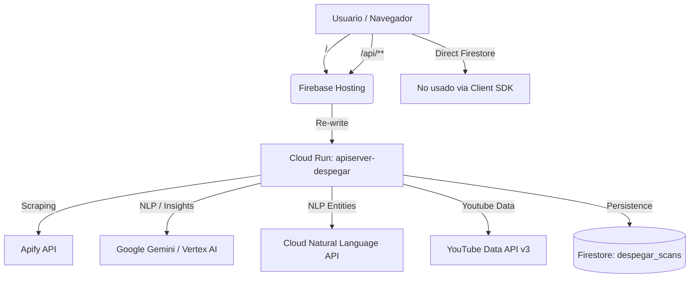

# 🚀 Guía de Arquitectura y Conexiones: Despegar Social Listener

Esta documentación detalla cómo están conectados todos los componentes del sistema para asegurar que cambios futuros no rompan la integración entre el Frontend, Backend y los servicios de Google Cloud.

## 🏗️ Mapa General del Sistema

El sistema utiliza una **Arquitectura Híbrida** en Google Cloud Platform (GCP):



---

## 🔗 Conexiones Críticas (El "Pegamento")

### 1. El Portal: `firebase.json`
Este es el archivo más importante para la conexión. Define que cualquier petición que empiece con `/api/` desde el frontend NO sea buscada como un archivo estático, sino que se redirija al contenedor de **Cloud Run**.

```json
"rewrites": [
  {
    "source": "/api/**",
    "run": {
      "serviceId": "apiserver-despegar",
      "region": "us-central1"
    }
  }
]
```
> [!IMPORTANT]
> Si cambias el nombre del servicio en Cloud Run o la región, el Frontend dejará de comunicarse con el Backend (Error 404 o 502).

### 2. Configuración API en Frontend (`frontend/src/config.js`)
El frontend está diseñado para ser agnóstico:
- **En desarrollo:** Usa `VITE_API_URL=http://localhost:3001` en un `.env.local`.
- **En producción:** La variable queda VACÍA (`''`). Esto obliga a usar rutas relativas (ej: `/api/scout`), permitiendo que el re-write de Firebase Hosting funcione automáticamente.

### 3. El Motor: `functions/` vs `backend/`
- **Carpeta Activa:** `functions/` es el código real del Social Listener v1.0. 
- **Carpeta Inactiva:** `backend/` es un legacy de una versión anterior. Ignoralo por ahora para evitar confusiones.
- **Entrypoints en `functions/`:**
    - `index.js`: Contiene toda la lógica de Express y los procesadores de IA.
    - `server.js`: El archivo que levanta el servidor en el puerto 8080 (requerido por Cloud Run).

---

## 🚀 Proceso de Despliegue (Sin Errores)

Para que el sistema funcione, ambos lados deben estar sincronizados. No despliegues uno sin verificar el otro si cambiaste la interfaz del API.

### Paso 1: Backend (Cloud Run)
Si modoficas algo en `functions/` (procesamiento, nuevos endpoints), debes desplegar a Cloud Run:
```bash
cd functions
gcloud run deploy apiserver-despegar --source . --region us-central1 --project hike-agentic-playground
```
*Esto sube el código, instala dependencias y reinicia el servicio.*

### Paso 2: Frontend (Firebase Hosting)
Si modificas la UI o los hooks:
```bash
cd frontend
npm run build
npx firebase deploy --only hosting --project hike-agentic-playground
```

---

## 🔑 Variables de Entorno y Secretos

El error "401" o "Scraper Failed" suele deberse a la falta de estas llaves en el panel de **Cloud Run > Variables de Entorno**:

| Variable | Descripción |
| :--- | :--- |
| `APIFY_API_KEY` | Token para ejecutar los scrapers de TikTok/Instagram. |
| `GEMINI_API_KEY` | Token para el procesamiento de IA con Gemini 1.5 Pro. |
| `YOUTUBE_API_KEY` | Llave para listar videos y comentarios de YouTube. |
| `GOOGLE_APPLICATION_CREDENTIALS` | Acceso a Natural Language API (Entities). |

---

## 🚨 Checklist Anti-Errores (Check antes de Push)

1. **¿Cambiaste el puerto?** Cloud Run espera que el `server.js` escuche en el puerto definido por `process.env.PORT` (default 8080).
2. **¿Rutas de API?** Asegúrate de que los nuevos endpoints en `index.js` empiecen con `/api/` o que uses el helper `registerRoute` que registra ambos (con y sin prefijo).
3. **¿CORS?** El backend debe tener habilitado CORS para permitir peticiones desde `despegar-social-listener.web.app`.
4. **¿Indices de Firestore?** Si el API da error 500 al filtrar, revisa los logs de Cloud Run. Firestore suele arrojar el link directo para crear el índice compuesto faltante.

---

## 📈 Flujo de Datos (Ejemplo: Scout Bot)
1. **Frontend** envía POST `/api/scout` con una URL de TikTok.
2. **Firebase Hosting** detecta `/api/` y manda la carga a **Cloud Run**.
3. **Cloud Run** lanza un **Actor en Apify**.
4. **Apify** devuelve JSON con comentarios.
5. **Cloud Run** manda los comentarios a **Gemini** para análisis.
6. **Cloud Run** guarda el resultado final en **Firestore**.
7. **Cloud Run** responde al **Frontend** con el análisis completo.
